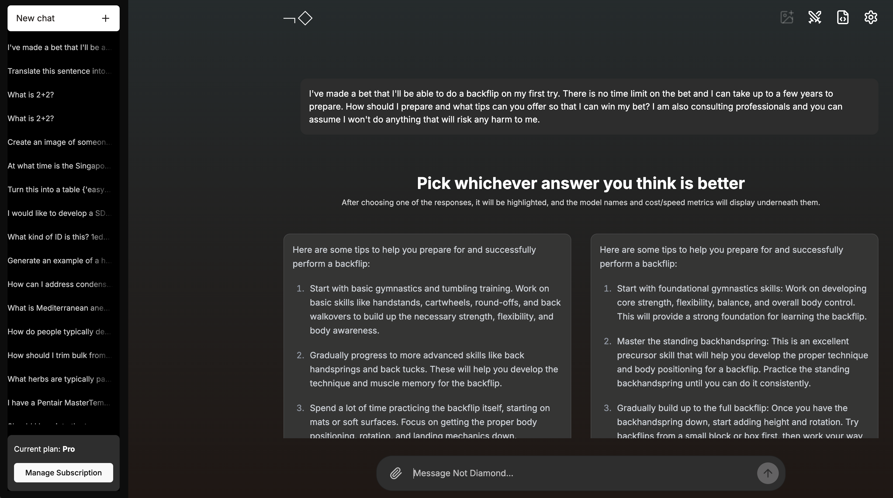

# notdiamond-examples

## Getting started

```shell
pyenv virtualenv 3.11 notdiamond-examples
pyenv activate notdiamond-examples
```

Install the dependencies:

```shell
poetry install
```

## Exploring Not Diamond

Create a `.env` file from the included template, making sure to populate keys for the providers
you would like to use. Then run the app:

```shell
streamlit run notdiamond_examples/streamlit/main.py
```

The app suggests some models for you to use, but you can also edit the app code to add [any
model supported by Not Diamond][supported].

## Testing RAG with Not Diamond

Not Diamond also supports RAG workflows. Try our RAG example out:

```shell
poetry install --with rag
streamlit run notdiamond_examples/streamlit/rag.py
```

### Query parameters

Concatenate these to the URL as follows:

```text
https://rag.notdiamond.ai?first_param=one&second_param=two
```

Supported parameters:

- `repo`: index a Github repo of the form `{user}/{project}`, eg. `Not-Diamond/notdiamond-python`.
- `repo_dir`: index all files in the Github repo originating in this directory (typically, `doc` or `docs`). Use `.` for all files.
- `repo_ext`: index all files with this extension (examples: `md`, `mdx`, `txt`, `rst`). You can specify multiple `repo_ext` parameters.
- `website`: scrape and index the content of the specified website (example: `https://example.com`).
- `follow_link`: scrape and index the content of the pages linked to from the website parameter. Set to `false` by default, but accepts `true`.
- `exclude_header_footer`: scrape and index the content of the pages linked to from the website parameter, and limit scraped links to 30. Set to `true` by default, but accepts `false`.
- `message`: a pre-populated background message in the text box (example: `Hello%20world`).

Example query parameters:

```text
# Index all .py files from the examples/ dir of posit-dev/py-shiny
https://rag.notdiamond.ai/?repo=posit-dev/py-shiny&repo_dir=examples&repo_ext=py

# Index all .mdx files from the docs/ dir of langchain-ai/langchain
https://rag.notdiamond.ai/?repo=langchain-ai/langchain&repo_dir=docs&repo_ext=mdx
```

## Chat with Not Diamond

Want to test out image generation? Watch the most popular models battle in Arena Mode? [Chat with Not Diamond].

<p align="center">
  
</p>

## Support

For support please check out the [docs] or send us a [message].

[supported]: https://notdiamond.readme.io/docs/llm-models
[docs]: https://notdiamond.readme.io
[message]: mailto:support@notdiamond.ai
[Chat with Not Diamond]: https://chat.notdiamond.ai